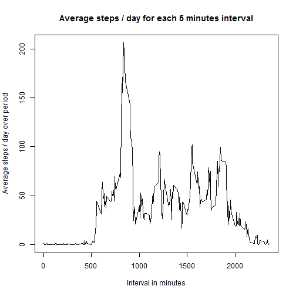

# Introduction

This is a R Markdown document containing the result of the first assignment for the Reproducible Research course at Coursera.  
Code and results have been included in this document and the choosen output will be HTML.

The code is included in this repository. Find it as: RepRes_prog1.R

For more details on using R Markdown see <http://rmarkdown.rstudio.com>.

## Previous steps

Some task should be done  before to start the analysis:

1. Set up for the global options  


```r
knitr::opts_knit$set(echo=TRUE, results="asis", progress = TRUE, verbose = TRUE, fig.width = 15, fig.height = 8)
```
  
2. **Remeber** to download and unzip the data from this **[link]**(https://d396qusza40orc.cloudfront.net/repdata%2Fdata%2Factivity.zip) into your working directory. You can use this code:  
  

```r
# To download the file
download.file("https://d396qusza40orc.cloudfront.net/repdata%2Fdata%2Factivity.zip", destfile = "activity.zip")
downloadDate <- format(Sys.time(), "%X %d-%m-%Y")
# To unzip the file and delete the zip file
unzip(zipfile = "activity.zip",exdir = ".")
file.remove("Factivity.zip")
```
  
3. Also you should load some libraries. This script would require the following libraries:


```r
library(lubridate)
library(RColorBrewer)
library(lattice)
library(knitr)
library(dplyr)
```

# Loading and preprocessing the data

1. Once you have the file "activity.csv" on your working directory you can load the data into the data frame "activity"  


```r
activity <- read.csv("activity.csv")
```
  
  
We expect "activity" to have three columns: steps, date and interval  

```r
head(activity)
```

  steps       date interval
1    NA 2012-10-01        0
2    NA 2012-10-01        5
3    NA 2012-10-01       10
4    NA 2012-10-01       15
5    NA 2012-10-01       20
6    NA 2012-10-01       25
  
  
  
# What is mean total number of steps taken per day?

To calculate the number of steps / each day I had used 'dplyr'

1. Calculate the total number of steps group the data fame using 'date' as key factor.


```r
stepsDay <- summarize(group_by(activity,date),totalSteps = sum(steps,na.rm = TRUE))
```

2. Represent the number of steps per day on a Histogram. Prior to generate the histogram a new palette of colors will be
defined using RColorBrewer library  


```r
# Generate the histogram for stepsDay
# Create a palette to represent the values
pal<-colorRampPalette(brewer.pal(12,"Paired"))
# Also adjust the margins
par(mai=c(1.25,2.25,0.82,0.2))
# Create the plot
hist(stepsDay$totalSteps, col = pal(15),xlab="Total Steps / Day", main="Histogram. Total Steps per Day", nclass = 20)
```

 
  
3. Next will calculate the mean/median of total steps per day using 'stepsDay'. I had used ceiling to round the number of steps. The reason being is I want to consider the number of steps as an integer, I consider it has more "physical" sense.  


```r
stepsDay_mean <- round(mean(stepsDay$totalSteps, na.rm = TRUE),digits=0)
stepsDay_median <- round(median(stepsDay$totalSteps, na.rm = TRUE),digits=0)
```
  

Looking to the histogram we can see the **maximum frecuency** for the range **10000 - 11000** steps/day. The **mean** number of steps/day is $9354$ which is quite different from the maximum frecuency. Although the **median** number of steps per day, $1.0395 &times; 10<sup>4</sup>$, falls inside this range. The reason being could be the big amount of data accumulated on the 0 - 1000 steps/day range.
  
  
  
# What is the average daily activity pattern?
  
1. Calculate the avg number of steps for each interval each day using 'group_by' over 'activity' and 'interval' as key.
  

```r
AvgstepsInterval <- summarize(group_by(activity,interval),Avgsteps = mean(steps,na.rm = TRUE))
```
  
2. I will create the plot using the plot function.


```r
plot(x=AvgstepsInterval$interval,y=AvgstepsInterval$Avgsteps,col=1,xlab="Interval in minutes",ylab="Average steps / day over period",main="Average steps / day for each 5 minutes interval", type="l")
```

 
  
3. Now we can calculate the interval when the maximum average number of steps happens and also the maximum value


```r
Interval_MaxAvgSteps <- AvgstepsInterval[AvgstepsInterval$Avgsteps == max(AvgstepsInterval$Avgsteps),"interval"]
Interval_MaxAvgSteps_Val <- AvgstepsInterval[AvgstepsInterval$Avgsteps == max(AvgstepsInterval$Avgsteps),"Avgsteps"]
```
  
  
  The **Maximum Average number of steps** per interval is 206.1698113 and it happens along the **interval** 835. Looking to the graph a big activity during the first ours in the morning. This is specially intense between 0800 and 0900 where the number of steps goes over 150 units. After that the activity and stay below 100 steps per period. Around 1900 the activity starts to falls to near to zero around midnight. The activity stay near zero until the next morning around 0530. 
  
  
  
# Imputing missing values

1. Calculate the number of NA presents on activity  


```r
Activity_NA <- as.numeric(sum(is.na(x = activity$steps)))
```

  Activity_NA <- as.numeric(sum(is.na(x = activity$steps)))

2. I will use the average value over the whole file for the same interval to fill the gaps on the data frame. First I have added a column with this average value for each interval
  

```r
activityWithMeans<-merge(activity,AvgstepsInterval,by="interval")
```
  
3. Now we change the NA values using the value on the new column. After that I select the first three columns and remove the unnecessary columns
 

```r
activityWithMeans[is.na(activityWithMeans$steps),"steps"]<-activityWithMeans[is.na(activityWithMeans$steps),"Avgsteps"]
activity_Filled <- arrange(select(activityWithMeans,3,1,2),date)
```
  
4. Create a new data frame with the total steps per day using the data frame where we filled the NA values using the average value
  

```r
stepsDay_Fill <- summarize(group_by(activity_Filled,date),totalSteps = sum(steps,na.rm = TRUE))
```
  
5. We plot an Histogram using the data frame created in the previous step. First step will be create a new palette of colors.  


```r
#  Create the pallette of colors
pal<-colorRampPalette(brewer.pal(12,"Paired"))
#  Also adjusting margins
par(mai=c(1.25,2.25,0.82,0.2))
# Create the plot
hist(stepsDay_Fill$totalSteps, col = pal(15),xlab="Total Steps / Day", main="Histogram. Total Steps per Day", nclass = 20)
```

 
  
6. At last I am going calculate the new mean and median after we filled the gaps on the data frame. Again I have rounded the value for the mean and the median to an integer, as integer values have more 'physical' meaning. I have calculated also the differnce between then new and the original values.  
  

```r
stepsDay_Fillmean <- round(mean(stepsDay_Fill$totalSteps, na.rm = TRUE),0)
stepsDay_Fillmedian <- round(median(stepsDay_Fill$totalSteps, na.rm = TRUE),0)
stepsDay_meanDiff <- stepsDay_Fillmean - stepsDay_mean
stepsDay_medianDiff <- stepsDay_Fillmedian - stepsDay_median
original_Diff <- stepsDay_median - stepsDay_mean
```
  
The data frame had **2304** missed values. These values were not considered during the first analysis. In this block I had replaced these values for the average value, across the whole data frame, for the same interval. The reason being is I have consider the activity between days similar around the same time.  
  
The original **mean** value 9354 has changed to **1.0766 &times; 10<sup>4</sup>**. Also the **median** has changed from 1.0395 &times; 10<sup>4</sup> to **1.0766 &times; 10<sup>4</sup>**. Even when both values have increased, mean increased by **1412**  while the median increased by **371**, we can see that the filled values affect more the mean rather than the median. Another difference whit the original data frame is now the mean and the median have the same value while in the original one they were different (**1041** steps).  
  
Looking to the histogram we can see it has slightly changed. The frecuency for the values on the range 10000 - 11000 steps/day has increased whishtl the frecuency for the range 0 - 1000 steps/day has decreaed drastically. That result converges with the first analysis.
  
  
# Are there differences in activity patterns between weekdays and weekends?
  
1. Create a new factor. The new factor will only have two levels **"Weekend"** and **"Weekday"**. The new factor is created from the value on the column 'date'.
  

```r
activity_FilledWD<-activity_Filled
activity_FilledWD$weekday<-as.POSIXlt(activity_FilledWD$date)$wday
```
  
2. The new column has values between 1 and 7 where, according to the regional configuration on my system, 1 is Monday and 7 is Sunday. We assign the value "Weekday" for any value between 1 and 5 and "weekend" to the rest  
  

```r
activity_FilledWD[activity_FilledWD$weekday>=6,"weekday"]<-"weekend"
activity_FilledWD[activity_FilledWD$weekday<=5,"weekday"]<-"weekday"
```
  
3. Next we calculate the average number of steps for each interval depending on if it was weekday or weekend  
  

```r
Avgsteps_WDInterval <- summarize(group_by(activity_FilledWD,weekday,interval),Avgsteps = mean(steps,na.rm = TRUE))
```
  
4. We represent the new data fram on a plot  
  

```r
graph<-xyplot(Avgsteps~interval | weekday, Avgsteps_WDInterval,layout=c(1,2),type="l")
print(graph)
```

 
  
  
