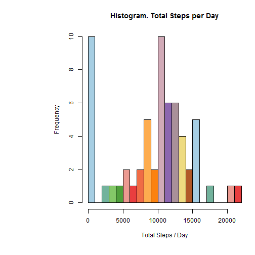
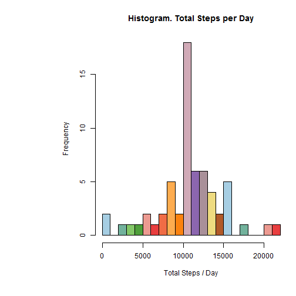

# Introduction

This is a R Markdown document containing the result of the first assignment for the Reproducible Research course at Coursera.  
Code and results have been included in this document and the choosen output will be HTML.

You will find in this repossitory the following files:  
- RepRes_prog1.R. The R full code for this analysis  
- PA1_template.rmd. RMarkdown file for this Assignment  
- PA1_template.html. HTML file. Result of publishing 'PA1_template.rmd' using 'knitr'  
  
## About the data  
  
It is now possible to collect a large amount of data about personal movement using activity monitoring devices such as a Fitbit, Nike Fuelband, or Jawbone Up. These type of devices are part of the "quantified self" movement - a group of enthusiasts who take measurements about themselves regularly to improve their health, to find patterns in their behavior, or because they are tech geeks. But these data remain under-utilized both because the raw data are hard to obtain and there is a lack of statistical methods and software for processing and interpreting the data.  
  
This assignment makes use of data from a personal activity monitoring device. This device collects data at 5 minute intervals through out the day. The data consists of two months of data from an anonymous individual collected during the months of October and November, 2012 and include the number of steps taken in 5 minute intervals each day.  
  
## Data
  
The variables included in this dataset are:  

    - steps: Number of steps taking in a 5-minute interval (missing values are coded as NA)
  
    - date: The date on which the measurement was taken in YYYY-MM-DD format
  
    - interval: Identifier for the 5-minute interval in which measurement was taken
  
The dataset is stored in a comma-separated-value (CSV) file and there are a total of 17,568 observations in this dataset.  
  
For more details on using R Markdown see <http://rmarkdown.rstudio.com>.  
  
## Objective
  
The main objective of this analysis is find a pattern for the activity habits using the given data.
  
## Previous steps
  
Some task should be done  before to start the analysis:  
  
1 Set up for the global options  
  

```r
knitr::opts_knit$set(echo=TRUE, results = "asis" ,progress = TRUE, verbose = TRUE, fig.width = 15, fig.height = 8)
```
  
2 **Remeber** to download and unzip the data from this **[link]**(https://d396qusza40orc.cloudfront.net/repdata%2Fdata%2Factivity.zip) into your working directory. You can use this code:  
  

```r
# To download the file
download.file("https://d396qusza40orc.cloudfront.net/repdata%2Fdata%2Factivity.zip", destfile = "activity.zip")
downloadDate <- format(Sys.time(), "%X %d-%m-%Y")
# To unzip the file and delete the zip file
unzip(zipfile = "activity.zip",exdir = ".")
file.remove("Factivity.zip")
```
  
3 Also you should load some libraries. This script would require the following libraries:  
  

```r
library(lubridate)
library(RColorBrewer)
library(lattice)
library(knitr)
library(dplyr)
```
  
# Loading and preprocessing the data  
  
1 Once you have the file "activity.csv" on your working directory you can load the data into the data frame "activity"  
  

```r
activity <- read.csv("activity.csv")
```
  
As explained in the introduction, I expected "activity" to have three columns: steps, date and interval  
  

```r
knit_print(head(activity))
```

  steps       date interval
1    NA 2012-10-01        0
2    NA 2012-10-01        5
3    NA 2012-10-01       10
4    NA 2012-10-01       15
5    NA 2012-10-01       20
6    NA 2012-10-01       25
  
  
  
# What is mean total number of steps taken per day?

To calculate the number of steps / each day I had used 'dplyr'

Calculate the total number of steps group the data fame using 'date' as key factor.


```r
stepsDay <- summarize(group_by(activity,date),totalSteps = sum(steps,na.rm = TRUE))
```

Represent the number of steps per day on a Histogram. Prior to generate the histogram a new palette of colors will be
defined using RColorBrewer library  


```r
# Generate the histogram for stepsDay
# Create a palette to represent the values
pal<-colorRampPalette(brewer.pal(12,"Paired"))
# Also adjust the margins
par(mai=c(1.25,2.25,0.82,0.2))
# Create the plot
hist(stepsDay$totalSteps, col = pal(15),xlab="Total Steps / Day", main="Histogram. Total Steps per Day", nclass = 20)
```

 
  
Next will calculate the mean/median of total steps per day using 'stepsDay'. I had used ceiling to round the number of steps. The reason being is I want to consider the number of steps as an integer, I consider it has more "physical" sense.  


```r
stepsDay_mean <- round(mean(stepsDay$totalSteps, na.rm = TRUE),digits=0)
stepsDay_median <- round(median(stepsDay$totalSteps, na.rm = TRUE),digits=0)
```
  
Looking to the histogram I could see the **maximum frecuency** on the range **10000 - 11000** steps/day. The **mean** number of steps/day is **9354** which is quite different from the maximum frecuency. Although the **median** number of steps per day, **1.0395 &times; 10<sup>4</sup>**, falls inside this range. The reason being could be the big amount of data accumulated on the 0 - 1000 steps/day range.
  
  
  
# What is the average daily activity pattern?
  
Calculate the avg number of steps for each interval each day using 'group_by' over 'activity' and 'interval' as key.
  

```r
AvgstepsInterval <- summarize(group_by(activity,interval),Avgsteps = mean(steps,na.rm = TRUE))
```
  
I will create the plot using the plot function.


```r
plot(x=AvgstepsInterval$interval,y=AvgstepsInterval$Avgsteps,col=1,xlab="Interval in minutes",ylab="Average steps / day over period",main="Average steps / day for each 5 minutes interval", type="l")
```

 
  
Now I can calculate the interval when the maximum average number of steps happens and also the maximum value


```r
Interval_MaxAvgSteps <- AvgstepsInterval[AvgstepsInterval$Avgsteps == max(AvgstepsInterval$Avgsteps),"interval"]
Interval_MaxAvgSteps_Val <- AvgstepsInterval[AvgstepsInterval$Avgsteps == max(AvgstepsInterval$Avgsteps),"Avgsteps"]
```
  
  
  The **Maximum Average number of steps** per interval is **206.1698113** and it happens along the **interval 835**. Looking to the previous graph I could see an intense activity during the first hours in the morning. This is specially intense between 0800 and 0900 where the number of steps goes over 150 units. After that the activity and stay below 100 steps per period. Around 1900 the activity starts to falls to near to zero around midnight. The activity stay near zero until the next morning around 0530. 
  
  
  
# Imputing missing values

Calculate the number of NA presents on activity  


```r
Activity_NA <- as.numeric(sum(is.na(x = activity$steps)))
```

I will use the average value over the whole file for the same interval to fill the gaps on the data frame. First I have added a column with this average value for each interval
  

```r
activityWithMeans<-merge(activity,AvgstepsInterval,by="interval")
```
  
Now I am going to change the NA values using the value on the new column. After that I select the first three columns and remove the unnecessary columns
 

```r
activityWithMeans[is.na(activityWithMeans$steps),"steps"]<-activityWithMeans[is.na(activityWithMeans$steps),"Avgsteps"]
activity_Filled <- arrange(select(activityWithMeans,3,1,2),date)
```
  
In this step I am going to create a new data frame with the total steps per day using the data frame where I filled up the NA values  
  

```r
stepsDay_Fill <- summarize(group_by(activity_Filled,date),totalSteps = sum(steps,na.rm = TRUE))
```
  
Next action will be plot an Histogram using the data frame created in the previous step. First step will be create a new palette of colors.  


```r
#  Create the pallette of colors
pal<-colorRampPalette(brewer.pal(12,"Paired"))
#  Also adjusting margins
par(mai=c(1.25,2.25,0.82,0.2))
# Create the plot
hist(stepsDay_Fill$totalSteps, col = pal(15),xlab="Total Steps / Day", main="Histogram. Total Steps per Day", nclass = 20)
```

 
  
At last I am going calculate the new mean and median after I filled up the gaps on the data frame. Again I have rounded the value for the mean and the median to an integer, as integer values have more 'physical' meaning. I have calculated also the differnce between then new and the original values.  
  

```r
stepsDay_Fillmean <- round(mean(stepsDay_Fill$totalSteps, na.rm = TRUE),0)
stepsDay_Fillmedian <- round(median(stepsDay_Fill$totalSteps, na.rm = TRUE),0)
stepsDay_meanDiff <- stepsDay_Fillmean - stepsDay_mean
stepsDay_medianDiff <- stepsDay_Fillmedian - stepsDay_median
original_Diff <- stepsDay_median - stepsDay_mean
```
  
  
The data frame had **2304** missed values. These values were not considered during the first analysis. In this block I had replaced these values for the average value, across the whole data frame, for the same interval. The reason being is I have consider the activity between days similar around the same time.  
  
The original **mean** value 9354 has changed to **1.0766 &times; 10<sup>4</sup>**. Also the **median** has changed from 1.0395 &times; 10<sup>4</sup> to **1.0766 &times; 10<sup>4</sup>**. Even when both values have increased, mean increased by **1412**  while the median increased by **371**, I could see that the filled values affect more the mean rather than the median. Another difference whit the original data frame is now the mean and the median have the same value while in the original one they were different (**1041** steps).  
  
Looking to the histogram I could see it has slightly changed. The frecuency for the values on the range 10000 - 11000 steps/day has increased whishtl the frecuency for the range 0 - 1000 steps/day has decreaed drastically. That result converges with the first analysis.
  
  
# Are there differences in activity patterns between weekdays and weekends?
  
Create a new factor. The new factor will only have two levels **"Weekend"** and **"Weekday"**. The new factor is created from the value on the column 'date'.
  

```r
activity_FilledWD<-activity_Filled
activity_FilledWD$weekday<-as.POSIXlt(activity_FilledWD$date)$wday
```
  
The new column has values between 1 and 7 where, **according to the regional configuration on my system, 1 is Monday and 7 is Sunday**. I have assigned the value "Weekday" for any value between 1 and 5 and "weekend" to the rest  
  

```r
activity_FilledWD[activity_FilledWD$weekday>=6,"weekday"]<-"weekend"
activity_FilledWD[activity_FilledWD$weekday<=5,"weekday"]<-"weekday"
```
  
Next I am going to calculate the average number of steps for each interval depending on if it was weekday or weekend  
  

```r
Avgsteps_WDInterval <- summarize(group_by(activity_FilledWD,weekday,interval),Avgsteps = mean(steps,na.rm = TRUE))
```
  
In this step I am going to represent the new data frame on a plot  
  

```r
graph<-xyplot(Avgsteps~interval | weekday, Avgsteps_WDInterval,layout=c(1,2),type="l")
print(graph)
```

 
  
  
On the graph the profile for the **weekends** present a peak on the acrivity during the morning with values over **200 steps/interval**. Also the profile for the **weekdays** present this peak on the activity however the maximum value stays between **150 and 200 steps/interval**. After that peak the activity decrease. After midday both profiles presents an increase in the activity again, however the values on the Weekend profile are, in average, bigger that the activity during the weekdays (**50-150** vs **50-100 steps/interval**).  
  
  
  
# Conclusions 
  
    
Along this study I have analyzed data from activity for an anonymous patiente. On the preliminar analysis, looking to the histogram, I could see that two ranges presented the maximum frecuency. One of them is range between 0 and 1000 steps/day. The other one is the range between **10000 - 11000** steps/day.  
  
To solve that question I have calculated the mean and median for the given group. In both the **mean** 9354 steps/day, and the **median** 1.0395 &times; 10<sup>4</sup> are close to the maximum frecuency range. The reason behind these values are not inside that range is the big amount of data accumulated on the first range 0 - 1000 steps/day range.  
  
After I have got an estimation to the number of steps this person will do along a day, I have analized the distribution of these steps along the day. The **Maximum Average number of steps** per interval, considering the given intervals of 5 minutes along the day, is 206.1698113 and it happens along the **interval** 835. 
  
Looking to the graph I can see a big activity during the first hours in the morning. This is specially intense between 0800 and 0900 where the number of steps goes over 150 units. After that the activity and stay below 100 steps per period. Around 1900 the activity starts to falls to near to zero around midnight. It easy to tell when this person was sleeping as the ativitity is reduced to near zero until the next morning around 0530 when it increases again.   

So, the person whose data is being analized, **walks around 1.0395 &times; 10<sup>4</sup> steps a day** and his moment of greatest activity is at 835 when he can do 206.1698113 steps/interval.  
  
However during this analysis I have found up to **2304** some missing values on the dataset. To fill these gaps I decided to use the average value, across the whole data frame, for the same interval. I choose that strategy because I have consider the activity at same time every day.  
  
After these gaps were filled the new values for the mean and median were different as expected.  


```r
results<-matrix(c(stepsDay_mean,stepsDay_Fillmean,stepsDay_median,stepsDay_Fillmedian),nrow=2,dimnames=list(c("Original","NewData"),c("Mean","Median")))
print(results)
```

          Mean Median
Original  9354  10395
NewData  10766  10766
    
In both cases the new values are bigger than the original ones: mean increased by **1412**  while the median increased by **371**. Looking to the new histogram I could see that the filled values affect more the mean rather than the median, which is normal as the mean is more affected by outlayer values. Another difference I could notice  is now the mean and the median have the same value while in the original one they were different (**1041** steps). That could mean we had more missing values around the intervals with medium activity and inside the range 10000 - 11000 steps/day.  
    
At last I have analized the data again trying to find a difference in the activity pattern between weekdays and weekend day. Although both graphs looked quite similar the profile for the **weekends** presents in general higher values than the **weekdays** profile. The peak on the activity during the morning increases from **150 and 200 steps/interval** during the weekdays to over **200 steps/interval** during the weekends. Some case for the intervals after midday were the activity changed from **50-100 steps/interval** to **50-150 stes/interval**.  
  
As a final conclusion. The studied subject walks around 9354 steps/day. He/she present a bigger activity during the mornings, specially around 835. And he/she is more active during the weekends rather than the weekdays.
